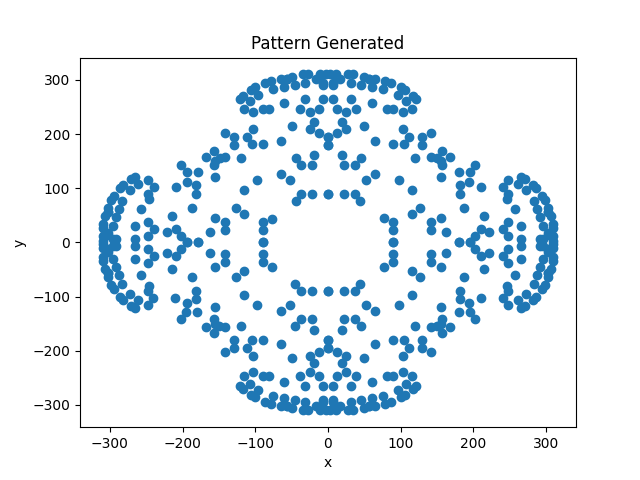

# Spiral Pattern Coordinate Generator 
# For Cultured Meat Simulation 

The folder contains: 
    1) genTree.py This file contians a function gen_tree() which will produce tree like branching patterns of cells.  
    2) Examples of coordinate files produced by this generator 
    3) Images of the generated patterns  

To use this generator: 
    1) Place it in the main PhysiCell directory (IE the desired location of your coordinates file) 
    2) Adjust the parameters within genTree.py to produce the desired tree structure 

Example file structure for running generator 

    .
    |
    PhysiCell
       -.
        |PhysiCell
        |System 
        |Files
        |
        |output       
        |genTree.py <--- 
        |coords.csv   

If a file called coords.csv already exists, it will be overwritten, if not, it will be created. 
